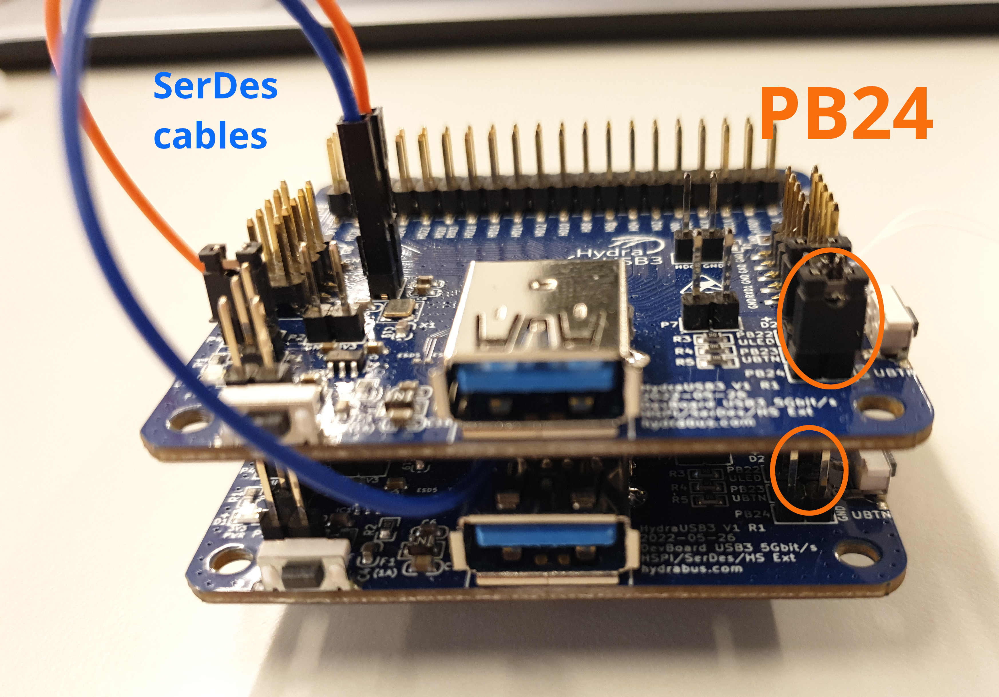

# SerDes

The SerDes (Serializer/Deserializer) is used in `test_firmware_serdes`.

To use SerDes, you need to connect both boards together like on the followin image

- Connect SerDes across both boards (GXP to GXP and GXM to GXM, see the following picture)

If you are confident in your abilities, you can also desolder the PB24 header on the top board and solder a female header on the other side of the board, so both PB24 jumpers will be connected together.

